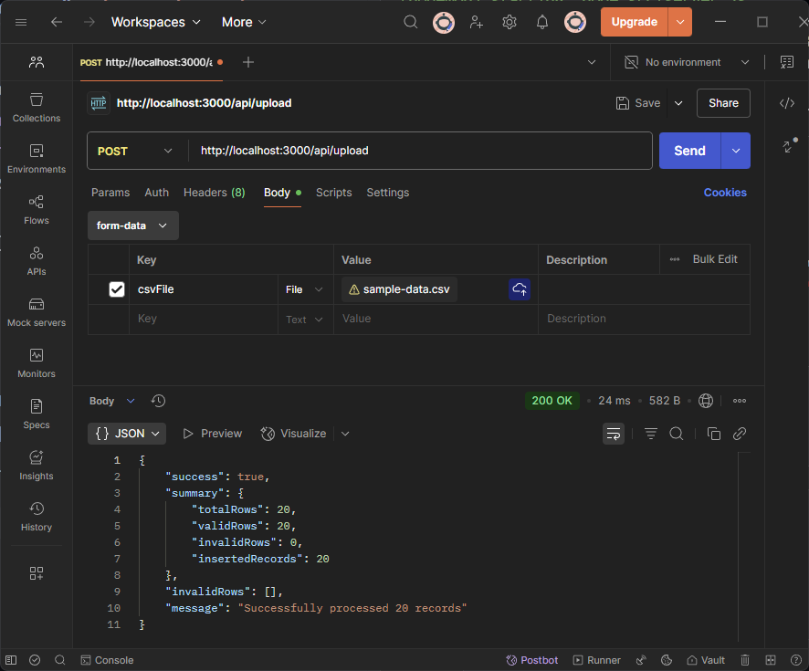
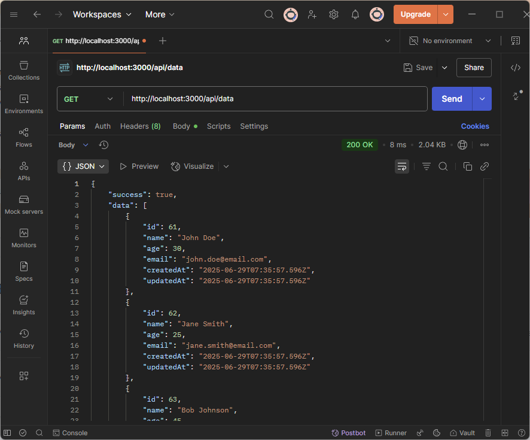
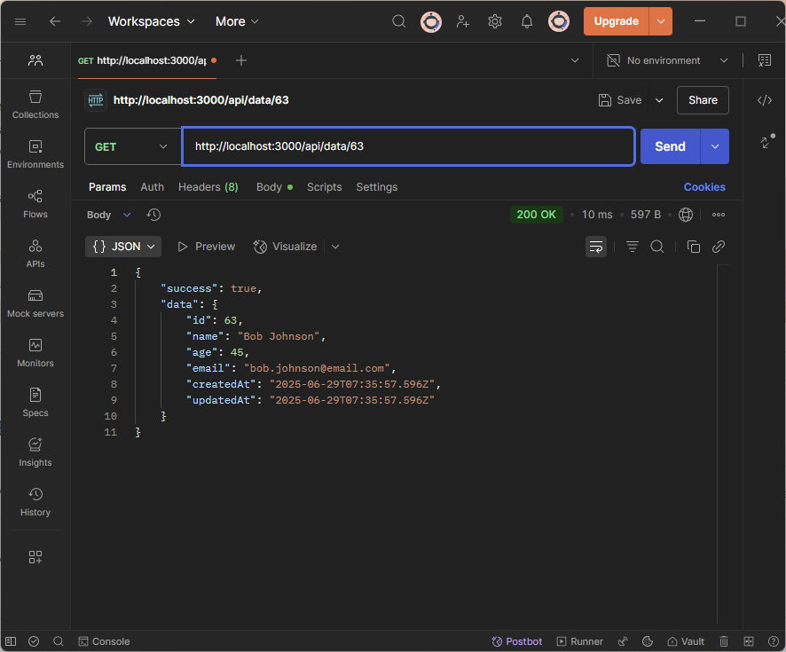
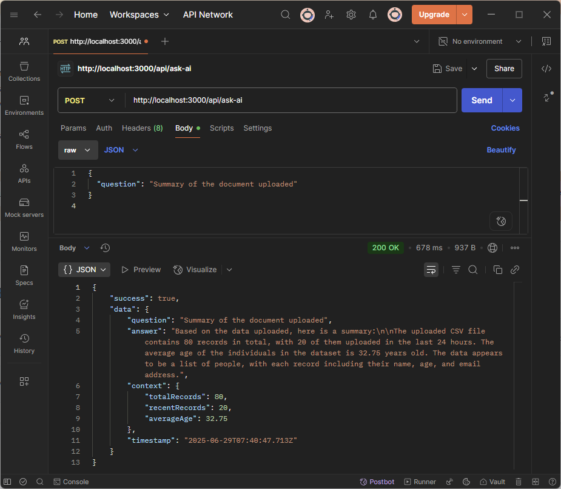

# iBee Analytics Backend

A powerful Express.js + Prisma + SQLite + Groq AI Assistant API for CSV data upload, querying, and AI-powered insights.

## Features

- **CSV Upload & Processing**: Upload CSV files with automatic validation and data insertion
- **RESTful API**: Complete CRUD operations for data management
- **AI Assistant**: Groq-powered AI assistant for data insights and questions
- **Request Logging**: Comprehensive logging to files and database
- **Modern Frontend**: Clean, responsive web interface
- **Data Validation**: Robust CSV validation with error reporting
- **Real-time Stats**: Live data statistics and monitoring

## How This Meets the Assignment Requirements

| Assignment Requirement                                                                | Implementation in This Project                                                                                    |
| ------------------------------------------------------------------------------------- | ----------------------------------------------------------------------------------------------------------------- |
| Accepts a CSV file upload                                                             | Users can upload CSV files via a web form or the `/api/upload` REST endpoint using Multer middleware.             |
| Validates the data (e.g., checks for missing values, incorrect types)                 | Uploaded CSV rows are validated for required fields and correct types using custom logic in `csvValidator.js`.    |
| Stores the data in a database (SQLite or PostgreSQL)                                  | Data is stored in a SQLite database using Prisma ORM, as configured in `.env` and `schema.prisma`.                |
| Exposes REST API endpoints to query the stored data                                   | RESTful endpoints (`/api/data`, `/api/data/:id`, etc.) allow querying, filtering, and pagination of records.      |
| Logs all API activity (e.g., each request made) to a file or database table           | All API requests are logged to `api.log` and the `Log` table in the database using Winston and Prisma.            |
| (Optional) Integrate a basic AI assistant to answer questions about the uploaded data | Integrated Groq AI (Llama3-70B) assistant via `/api/ask-ai` for natural language queries about the uploaded data. |
| (Optional) Use Swagger/OpenAPI to document and test your API                          | Not implemented; API documentation and usage examples are provided in the README and sample requests.             |
| (Optional) Implement basic input authentication                                       | Implemented - Simple token-based authentication with demo tokens for secure endpoint access.                      |

## Tech Stack

- **Backend**: Express.js, Node.js
- **Database**: SQLite with Prisma ORM
- **AI**: Groq SDK (Llama3-70B-8192)
- **File Processing**: Multer, CSV-Parser
- **Logging**: Winston
- **Frontend**: Vanilla HTML/CSS/JavaScript

## Prerequisites

- Node.js 16+ and npm
- Groq API key (get from [Groq Console](https://console.groq.com/))

## Quick Start

### 1. Clone and Install

```bash
git clone <your-repo-url>
cd ibee-analytics-backend
npm install
```

### 2. Configure Environment

```bash
# Copy .env and update with your Groq API key
cp .env.example .env
```

Update `.env`:

```env
DATABASE_URL="file:./dev.db"
GROQ_API_KEY="your-groq-api-key-here"
PORT=3000
NODE_ENV=development
```

### 3. Initialize Database

```bash
npm run db:migrate
```

### 4. Start Development Server

```bash
npm run dev
```

Visit: http://localhost:3000

## Authentication

This application uses simple token-based authentication for secure operations.

### Demo Tokens

- `demo-token-123` - Demo access
- `admin-token-456` - Admin access
- `user-token-789` - User access

### Protected vs Public Endpoints

**Public Endpoints (No authentication required):**

- `GET /api/health` - Health check
- `GET /api/auth/info` - Get authentication information

**Optional Authentication:**

- `GET /api/data/stats` - Basic stats for all, detailed stats for authenticated users

**Protected Endpoints (Authentication required):**

- `POST /api/upload` - Upload CSV file
- `GET /api/data` - Get all records
- `GET /api/data/:id` - Get record by ID
- `POST /api/ask-ai` - Ask AI questions
- `GET /api/ai/history` - Get AI history

### How to Authenticate

**Option 1: Authorization Header**

```bash
curl -H "Authorization: Bearer demo-token-123" http://localhost:3000/api/data
```

**Option 2: Query Parameter (for testing)**

```bash
curl "http://localhost:3000/api/data?token=demo-token-123"
```

**Option 3: Web Interface**

- Enter token in the authentication section on the homepage
- Token is saved in localStorage for subsequent requests

## API Endpoints

### Data Operations

- `GET /api/health` - Health check
- `GET /api/data/stats` - Get data statistics
- `GET /api/data` - Get all records (with pagination & filtering)
- `GET /api/data/:id` - Get record by ID
- `POST /api/upload` - Upload CSV file

### AI Assistant

- `POST /api/ask-ai` - Ask AI questions about data
- `GET /api/ai/history` - Get AI conversation history

### Query Parameters (GET /api/data)

- `page` - Page number (default: 1)
- `limit` - Records per page (default: 10)
- `name` - Filter by name (partial match)
- `minAge` - Minimum age filter
- `maxAge` - Maximum age filter
- `email` - Filter by email (partial match)

## CSV Format

Expected CSV columns:

- `name` (required) - Person's name
- `age` (optional) - Person's age (number)
- `email` (optional) - Person's email

Example CSV:

```csv
name,age,email
John Doe,30,john@example.com
Jane Smith,25,jane@example.com
Bob Johnson,45,bob@example.com
```

## AI Assistant Examples

Ask questions like:

- "What's the average age in the dataset?"
- "How many records do we have?"
- "Tell me about the data distribution"
- "What insights can you provide about the uploaded data?"

## API Examples

### Upload CSV

```bash
curl -X POST http://localhost:3000/api/upload \
  -F "csvFile=@data.csv"
```

### Get All Records

```bash
curl "http://localhost:3000/api/data?page=1&limit=10"
```

### Ask AI

```bash
curl -X POST http://localhost:3000/api/ask-ai \
  -H "Content-Type: application/json" \
  -d '{"question": "What is the average age?"}'
```

## Postman API Testing

The following Postman screenshots demonstrate successful testing of all major API endpoints:

### Upload CSV File


_Testing the POST /api/upload endpoint with CSV file upload_

### Get All Data Records


_Testing the GET /api/data endpoint with pagination and filtering_

### Get Record by ID


_Testing the GET /api/data/:id endpoint to retrieve a specific record_

### AI Assistant Query


_Testing the POST /api/ask-ai endpoint for AI-powered data insights_

All endpoints are fully functional and properly return JSON responses with appropriate status codes and data structures.

## Response Examples

### Successful Upload

```json
{
  "success": true,
  "summary": {
    "totalRows": 100,
    "validRows": 95,
    "invalidRows": 5,
    "insertedRecords": 95
  },
  "invalidRows": [...],
  "message": "Successfully processed 95 records"
}
```

### Data Query

```json
{
  "success": true,
  "data": [
    {
      "id": 1,
      "name": "John Doe",
      "age": 30,
      "email": "john@example.com",
      "createdAt": "2025-06-28T05:52:54.000Z",
      "updatedAt": "2025-06-28T05:52:54.000Z"
    }
  ],
  "pagination": {
    "currentPage": 1,
    "totalPages": 10,
    "totalRecords": 95,
    "recordsPerPage": 10,
    "hasNextPage": true,
    "hasPreviousPage": false
  }
}
```

### AI Response

```json
{
  "success": true,
  "data": {
    "question": "What is the average age?",
    "answer": "Based on the current data, the average age is 32.5 years...",
    "context": {
      "totalRecords": 95,
      "recentRecords": 95,
      "averageAge": 32.5
    },
    "timestamp": "2025-06-28T05:52:54.000Z"
  }
}
```

## Testing

Use the included frontend or test with tools like:

- **Postman**: Import the API collection
- **curl**: See examples above
- **Frontend**: http://localhost:3000

## Scripts

```bash
npm run dev          # Start development server with nodemon
npm start            # Start production server
npm run db:migrate   # Run Prisma migrations
npm run db:studio    # Open Prisma Studio
```

## Project Structure

```
ibee-analytics-backend/
├── prisma/
│   ├── schema.prisma          # Database schema
│   └── migrations/            # Database migrations
├── public/
│   ├── upload.html           # Frontend interface
│   └── style.css             # Styles
├── src/
│   ├── server.js             # Main server file
│   ├── routes.js             # API routes
│   ├── controllers/
│   │   ├── uploadController.js    # CSV upload handling
│   │   ├── queryController.js     # Data queries
│   │   └── aiController.js        # AI assistant
│   ├── middleware/
│   │   └── logger.js         # Request logging
│   └── utils/
│       └── csvValidator.js   # CSV validation
├── logs/
│   └── api.log              # API request logs
├── .env                     # Environment variables
├── package.json
└── README.md
```

## Security Notes

- File upload size limited to 5MB
- CSV validation prevents malicious data
- Environment variables for sensitive data
- Request logging for monitoring
- CORS enabled for development

## Troubleshooting

### Common Issues

1. **Groq API Key Error**

   - Ensure `GROQ_API_KEY` is set in `.env`
   - Verify key is valid at Groq Console

2. **Database Connection Error**

   - Run `npm run db:migrate` to initialize database
   - Check `DATABASE_URL` in `.env`

3. **File Upload Issues**

   - Ensure CSV file is properly formatted
   - Check file size (5MB limit)
   - Verify required columns exist

4. **Port Already in Use**
   - Change `PORT` in `.env` or stop conflicting process

## Performance Tips

- Use pagination for large datasets
- Monitor log file size in production
- Consider database indexing for large datasets
- Rate limit AI requests if needed

## Contributing

1. Fork the repository
2. Create feature branch (`git checkout -b feature/amazing-feature`)
3. Commit changes (`git commit -m 'Add amazing feature'`)
4. Push to branch (`git push origin feature/amazing-feature`)
5. Open Pull Request

## License

This project is licensed under the MIT License - see the [LICENSE](LICENSE) file for details.

## Support

For questions or issues:

1. Check this README
2. Review API documentation
3. Create an issue on GitHub
4. Check logs in `logs/api.log`

---

<div align="center">
Made with ❤️ by Rayean Patric
</div>
